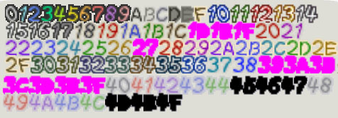

# `.msg` syntax

## Character Set

`[font=normal]`: 𝅘𝅥𝅮!#$%&'()*+,-./0123456789:;<=>?@ABCDEFGHIJKLMNOPQRSTUVWXYZ\[¥]^_`abcdefghijklmnopqrstuvwxyz{|}~°ÀÁÂÄÇÈÉÊËÌÍÎÏÑÒÓÔÖÙÚÛÜßàáâäçèéêëìíîïñòóôöùúûü¡¿ª♥★↑↓←→●✖“”‘’ ⒶⒷⓈ▲▼◀▶ⓁⓇⓏ

`[font=title]` and `[font=subtitle]`: ABCDEFGHIJKLMNOPQRSTUVWXYZ'.,0123456789©&

## Tags

Similar to BBCode, tags begin with `[` and end with `]`. They may take positional arguments (`value`) and named arguments (`arg=value`). The order of named arguments does not matter. Values are parsed as integers if possible, and hexidecimal integers are supported. Tag names and argument names are case-insensitive.

To write a literal `[` character (and not start a tag), prefix it with a backslash; i.e. `\[`.

### `[message name section= index=]...[/message]`

Marks the beginning and end of a message.

All parameters on the opening tag are optional.
If `section` and/or `index` are omitted, the message will be allocated a section and/or index respectively.

### `[br]`
Line break.

### `[prompt]`
Waits for the A button to be pressed before continuing.

### `[next]`
Scrolls down the message box to begin a new 'paragraph.'

### `[sleep n]`
Waits for `n` frames before continuing.

### `[color= ctx=]`

Supported color names are:

`ctx=normal` (default): normal red pink purple blue cyan green yellow

`ctx=diary`: normal red

`ctx=inspect`: dark

`ctx=button`: blue green red yellow gray grey

`ctx=popup`: normal red pink purple blue teal green yellow

`ctx=sign`: normal red blue green

To use other colors, provide `color` as an integer (e.g. `[color=0x10]`). Here are all the colors supported by the engine:

### `[/color]`
Resets the color to what it was before the most recent `[color=]` tag. The default color at the start of the message is assumed to be `[color=normal]`, which is true for most messages.

### `[a]` `[b]` `[l]` `[r]` `[z]` `[start]` `[c-up]` `[c-down]` `[c-left]` `[c-right]`

Shorthand for the button prompt characters ⒶⒷⓁⓇⓏⓈ▲▼◀▶ respectively. You can override the color used with a named parameter `[a color=]`.

Supported color names: blue green red yellow gray grey

### `[style=]`

Sets the box style to use for this message. Supported styles are:

`[style=right]` `[style=left]` `[style=center]` - Standard speech bubble with the speaker coming from the given direction

`[style=tattle]` - Small bubble used for overworld tattles

`[style=choice x= y= w= h=]` - Box for multiple-choice options

`[style=inspect]` - Internal narration box, often used when inspecting objects by pressing A

`[style=sign]` `[style=lamppost]` `[style=postcard]` - Boxes with custom backgrounds

`[style=popup]` - Box in center of screen that grows dynamically depending on how long the message is

`[style=upgrade x= y= w= h=]` - Super Block box

`[style=narrate]` - Narration; used when you obtain new partners

`[style=epilogue]` - Used for post-chapter descriptions of what Mario and party did

### `[font=]`

Supported fonts: normal title subtitle

Note that the `title` and `subtitle` fonts use a different character set to `normal`.

### `[/font]`

Resets the font to what it was before the most recent `[font=]` tag.

### `[noskip]...[/noskip]`

Disables the B button from skipping text within.

### `[instant]...[/instant]`

Causes all text within to appear instantly.

### `[kerning=]`

Modifies the spacing between letters.

### `[scroll n]`

Scrolls down `n` lines.

### `[size x= y=]`

Changes font size.

### `[/size]`

Resets the size back to x=10 y=10 (the default).

### `[speed delay= chars=]`

Changes text printing speed. `delay` is the number of frames between each print, and `chars` is the number of characters to print at once. For example, `[speed delay=5 chars=3]` would print 3 characters every 5 frames.

### `[pos x= y=]`

Overrides the current text printing position.

`x` is optional. If only `y` is provided, the x position will not change.

### `[indent n]`

Indents the following text by `n` tabs.

### `[up n]` and `[down n]`

Moves the text printing position up/down by `n` pixels respectively.

### `[image id]`

Displays the given image. This requires extra setup when printing the message.

There is also a 7-parameter variant of `image` that is not yet understood.

### `[sprite unknown id raster]`

Displays the given sprite.

### `[item a b]`

Displays the given world icon.

### `[cursor n]` and `[option n]`

Denotes the position for the hand cursor to appear and the start of the option text for choice `n` of a `[style=choice]` box.

### `[choicecount=]`

Sets the number of options given in this `[style=choice]` box.

### `[cancel=]`

Sets the option number to be selected if the user presses B.
If this is not provided, pressing B does nothing.

### Effects

- `[shaky]...[/shaky]`
- `[noise fade=]...[/noise]`
- `[faded-shaky fade=]...[/faded-shaky]`
- `[fade=]...[/fade]`
- `[shout]...[/shout]` or `[shrinking]...[/shrinking]`
- `[whisper]...[/whisper]` or `[growing]...[/growing]`
- `[scream]...[/scream]` or `[shaky-size]...[/shaky-size]`
- `[chortle]...[/chortle]` or `[wavy-size]...[/wavy-size]`
- `[shadow]...[/shadow]`

### `[var n]`

Replaced with the value of message variable `n`. Must be set before the message is printed.

### `[center=]`

Centers the following text. Parameter purpose is unknown.

### `[volume=]`

Changes the volume of the following text.

### `[sound=]`

Changes the speech sound for the following text.

Supported sound names: normal bowser spirit

You can also use an integer for the parameter.

### `[/sound]`

Resets the speech sound to what it was before the most recent `[sound=]` tag.

### `[note]` `[heart]` `[star]` `[circle]` `[cross]` `[arrow-up]` `[arrow-down]` `[arrow-left]` `[arrow-right]`

Equivalent to the characters 𝅘𝅥𝅮♥★●✖↑↓←→ respectively.

### `[raw ...]`

Outputs all arguments provided as bytes, without modification.

### `[func ...]`

Same as `raw`, but prefixed with 0xFF.

## Comments

`//` line comments are allowed anywhere outside of a `[message]...[/message]` block and will be ignored.
Block comments are not supported.
